# EduDash ERP - Enterprise Engineering Handbook & Architectural Manual

Welcome to the **EduDash ERP** engineering guide. This document serves as the absolute single source of truth for the frontend architecture, system design, data flows, and development roadmaps of the EduDash School ERP platform. It is designed to onboard developers, database administrators, QA testers, and technical evaluators into the platform's multi-portal framework.

---

## 📅 System Execution Status Matrix

To provide full transparency for frontend developers, backend engineers, and recruiters, the table below outlines the exact implementation state of every core ERP module:

| Module / Layer | Sub-System / Detail | Status | Execution Notes |
| :--- | :--- | :--- | :--- |
| **Student Portal** | Dashboard, timetable, transport, profile, achievements, subjects | ✅ Complete | Fully powered by mock services and custom grid cards. |
| **Parent Portal** | Academic dashboard, multi-child account switcher, invoices | ✅ Complete | Live context switching, dynamic layout rendering. |
| **Teacher Portal** | Rosters, gradebooks, attendance, mentorship logs | 🟡 In Progress | Basic workspace shell and mentor logs implemented. |
| **Admin Portal** | Master registers, calendar broadcasting, role configs | 🔴 Planned | Layout routing prepared; interface shells defined. |
| **Authentication** | Unified login form, credential validation | ✅ Complete | Simulated local validation and RBAC redirects. |
| **RBAC Gate** | Security wrapper, route protection rules | ✅ Complete | Checked in the rendering tree via `ProtectedRoute.jsx`. |
| **Routing System** | React Router v6 nested layout hierarchy | ✅ Complete | Fully stabilized layout tree with zero unmount loops. |
| **Service Layer** | Abstract promises, async adapters | ✅ Complete | Completely decoupled from presentation views. |
| **MockDB Engine** | Centralized database tables, dynamic joins | ✅ Complete | Standardized normalized schemas inside `MockDB.js`. |
| **Assignments** | Keywords search, subject filtering, status tracking | ✅ Complete | Restructured full-width layout with combinational filters. |
| **Attendance** | Subject cards, overall progress tracking | ✅ Complete | Fully reactive status indicators and low-attendance warnings. |
| **Fees & Billing** | Invoice ledger, billing categories | ✅ Complete | Observational ledger and payment modal simulations. |
| **Examinations** | Timetable, marks cards, progress reports | 🟡 In Progress | Static tables loaded; dynamic marks logs under active dev. |
| **Timetable** | Daily periods, calendar maps, room mappings | ✅ Complete | Responsive dashboard timetable card rendering. |
| **Notifications** | Alerts, announcements, support logs | 🟡 In Progress | Static general and exam notices rendered. |
| **Real Backend** | REST/GraphQL APIs, services | 🔴 Planned | Contract interfaces established in the service layer. |
| **Real Database** | Persistent relational PostgreSQL/MySQL DB | 🔴 Planned | Relational models ready for mapping. |
| **File Uploads** | Cloud-based attachment storage (AWS S3) | 🔴 Planned | UI simulates upload progress locally. |
| **WebSockets** | Real-time messaging, immediate notification push | 🔴 Planned | Scheduled for Phase 2 implementation. |
| **Analytics Engine** | Admin dashboards, student performance graphs | 🔴 Planned | Target analytical tracking maps created. |

**Legend**: 
*   `✅ Complete`: Production-ready UI and logic using the MockDB service layer.
*   `🟡 In Progress`: Active visual integration and mock service additions.
*   `🔴 Planned`: Architectural interfaces ready; awaiting backend service and database persistence layers.
*   `⚪ Deferred`: Post-release optimization or secondary feature integrations.

---

## 🏛️ System Rationale: Why This Architecture First?

We deliberately designed and built a **Frontend-First, Backend-Ready** architecture to solve critical enterprise scaling risks early in the project lifecycle:

1.  **API Contract Preparation**:
    By designing abstract async services (`services/`) first, we established complete data contract definitions (JSON payload structures, query parameters, types) before writing any backend code. When the APIs are built, the frontend service adapters can swap their data sources with zero modifications to the UI view components.
2.  **Workflow Validation and User Testing**:
    Building the frontend first allowed stakeholders and UX designers to test complex workflows—such as multi-child switching or assignment status flows—directly in the browser, eliminating expensive database schema redesigns later.
3.  **Visual Shell and Layout Stabilization**:
    ERPs are data-dense environments prone to layout shifts (CLS) and route unmounting bugs. Isolating the frontend allowed us to permanently stabilize nested layout outlets, performance memoizations, and loading skeletons.

---

## 🗃️ Folder Architecture Directory Map

The codebase is organized into clear directories to maintain a strict separation of concerns and ensure module-level scalability:

```txt
src/
 ├── auth/                 # Navigations, portal structural definitions, RBAC metadata
 ├── components/           # UI system shells (MainCard, HelperPopup, etc.)
 ├── context/              # Authentication, language translations, student portal contexts
 ├── data/                 # Common static lists, language dictionary frames
 ├── docs/                 # System architectural maps, DB schema references
 ├── hooks/                # Custom React Hooks (WeakMap useService, state handlers)
 ├── layouts/              # Stable UI shells (BaseLayout, PortalLayouts)
 ├── mockDB/               # Centralized normalized Relational Mock Database
 ├── pages/                # Lazy-loaded portal pages
 ├── routes/               # Access Control gates and route switch maps
 ├── services/             # Dynamic asynchronous service adapters
 ├── translations/         # Direct dictionary indices for EN/HI support
 └── utils/                # Date/time calculators and path resolvers
```

### Folder Responsibilities & Scale Intentions

#### 📂 `src/auth/`
*   **Ownership**: Security & Navigation.
*   **Responsibilities**: Defines layout navigation arrays, role metadata, and authorization privilege indexes.
*   **Scale Intention**: Acts as the single registry for registering new portals and mapping navigational access maps.

#### 📂 `src/layouts/`
*   **Ownership**: Shell & Frame Management.
*   **Responsibilities**: Manages standard global headers, mobile navigation drawers, and stable layout frames.
*   **Scale Intention**: Provides stable parent shells, ensuring that children pages mount cleanly inside static outlets without layout resets.

#### 📂 `src/routes/`
*   **Ownership**: Navigation Security.
*   **Responsibilities**: Controls route mappings, public/private pathways, and runs access validation checks.
*   **Scale Intention**: Enforces Role-Based Access Control (RBAC) across all portal scopes.

#### 📂 `src/pages/`
*   **Ownership**: View Layer.
*   **Responsibilities**: Coordinates structural presentation cards and handles view-specific states.
*   **Scale Intention**: Page components are lazy-loaded on-demand, reducing the initial load weight of the bundle.

#### 📂 `src/components/`
*   **Ownership**: Design System.
*   **Responsibilities**: Contains reusable UI elements (e.g. `MainCard.jsx`, `HelperPopup.jsx`, and loading skeletons).
*   **Scale Intention**: Prevents UI inconsistency. All layout files import shared components from this central folder.

#### 📂 `src/services/`
*   **Ownership**: Business Logic Gateway.
*   **Responsibilities**: Handles data transactions and executes business logic queries.
*   **Scale Intention**: Swapping local mock database adapters with persistent REST/GraphQL APIs occurs exclusively inside this directory.

#### 📂 `src/hooks/`
*   **Ownership**: State & Caching.
*   **Responsibilities**: Contains custom hooks (such as `useService.js`) to cache data, preventing redundant operations.
*   **Scale Intention**: Manages key-safe, garbage-collected object identity caching across all services.

#### 📂 `src/context/`
*   **Ownership**: Global Shared States.
*   **Responsibilities**: Controls application-wide contexts, such as `AuthContext.jsx` (session tokens) and `StudentContext.jsx` (multi-child toggling).
*   **Scale Intention**: Keeps context footprints minimal and focused, avoiding bloated state structures.

#### 📂 `src/mockDB/`
*   **Ownership**: In-Memory Relational Engine.
*   **Responsibilities**: Implements the normalized in-memory database tables.
*   **Scale Intention**: Models the relational schemas of a production database, ensuring services execute realistic query operations.

---

## 🔀 Layered Backend Integration Blueprint

EduDash's decoupled architecture makes it entirely backend-independent. Components do not know where data comes from; they strictly consume services through cache boundaries.

The flow diagram below illustrates the seamless transition from our current local simulation to a persistent SQL database:

```txt
┌────────────────────────────────────────────────────────────────────────┐
│                          1. VIEW COMPONENTS                            │
│   Renders layouts and cards; relies strictly on async services.       │
└───────────────────────────────────┬────────────────────────────────────┘
                                    ▼
┌────────────────────────────────────────────────────────────────────────┐
│                        2. SERVICE CACHE LAYER                          │
│   (useService.js - Key-safe WeakMap caching prevents redundant hits)   │
└───────────────────────────────────┬────────────────────────────────────┘
                                    ▼
┌───────────────────────────────────┴────────────────────────────────────┐
│                          3. SERVICES GATEWAY                           │
│   Abstract service adapters returning structured Promises.             │
└─────────┬───────────────────────────────────────────┬──────────────────┘
          │ (CURRENT PHASE)                           │ (PRODUCTION PHASE)
          ▼                                           ▼
┌───────────────────────────────────┐       ┌────────────────────────────┐
│     4. LOCAL DATABASE ADAPTER     │       │ 4. REST/GRAPHQL API CLIENT │
│   Retrieves records directly      │       │   Fetches live payloads    │
│   from in-memory MockDB.js.       │       │   over secure HTTP.        │
└─────────────────┬─────────────────┘       └──────────────┬─────────────┘
                  │                                        │
                  ▼                                        ▼
┌───────────────────────────────────┐       ┌────────────────────────────┐
│           5. MOCKDB.JS            │       │      5. CLOUD BACKEND      │
│   In-memory data tables.          │       │   Go / Node Services +     │
│                                   │       │   PostgreSQL / Redis.      │
└───────────────────────────────────┘       └────────────────────────────┘
```

---

## 🏢 ERP Domain Architecture & Ownership Model

In an enterprise ERP, portals must be categorized by their operational responsibilities:

### 🧑‍🏫 Teacher Portal: The Operational System
*   **Role**: Primary data writer.
*   **Entity Ownership**: Owns classroom records (attendance sheets, assignment parameters, grades).
*   **Write Operations**: Registers daily attendance logs, creates and issues assignments, uploads and corrects student marks.
*   **Read Operations**: Accesses assigned subject catalogs, student profiles, and parent contact registries.

### 🧑‍🎓 Student Portal: The Consumption & Execution System
*   **Role**: Primary consumer and task executor.
*   **Entity Ownership**: Owns personal submissions and co-curricular memberships.
*   **Write Operations**: Submits assignment files, registers for student club memberships.
*   **Read Operations**: Accesses class timetables, attendance summaries, pending homework feeds, report cards, and transport schedules.

### 🧑‍👩‍👦 Parent Portal: The Observational & Monitoring System
*   **Role**: Primary auditor and supervisor.
*   **Entity Ownership**: Holds guardian links to one or more student profiles.
*   **Write Operations**: Initiates payment transactions for tuition invoices, submits support queries.
*   **Read Operations**: Audits academic progress, monitors payment ledgers, tracks child attendance warnings, and views timetables.

### ⚙️ Admin Portal: The Governance System
*   **Role**: Primary system administrator.
*   **Entity Ownership**: Owns master metadata (classes, sections, transport routes, role structures).
*   **Write Operations**: Deploys class schedules, maps teacher-subject relationships, creates notices, and configures user security profiles.

---

## 🔄 Cross-Portal Data Flow

When a transaction or operational change occurs in one portal, it immediately propagates across the entire ERP ecosystem through our service layer:

### 1. Attendance Log Flow
*   **Action**: A teacher marks a student absent.
*   **Downstream Update**:
    1.  The `Attendance Service` logs the entry in `MockDB`.
    2.  The `Student Portal` recalculates attendance percentages.
    3.  If attendance drops below the 75% threshold, the `Parent Portal` renders an attention banner.
    4.  The global "Action Needed" home dashboard widget automatically displays a warning card.

### 2. Assignment Submission Flow
*   **Action**: A teacher publishes a new Physics assignment.
*   **Downstream Update**:
    1.  The `Assignment Service` appends the record and creates empty pending submission templates for all enrolled students.
    2.  The `Student Portal` displays the assignment in their task feed.
    3.  The `Parent Portal` marks the item as pending under the child's academic overview.
    4.  Once the student uploads their work, the status updates to `SUBMITTED`, notifying the teacher for grading.

### 3. Institutional Timetable Update
*   **Action**: An administrator updates the Thursday schedule.
*   **Downstream Update**:
    1.  The `Timetable Service` updates the master scheduler record.
    2.  The `Teacher Portal` displays the revised lesson block.
    3.  The `Student Portal` dynamically renders the updated timetable.
    4.  The `Parent Portal` displays the correct daily schedule.

---

## 🗃️ Complete Layered Entity Relationship Diagram (ERD)

The diagram below illustrates the complete database architecture, structured into logical operational domains and dependency layers. This serves as the database schema blueprint:

```mermaid
erDiagram
    %% ==========================================
    %% 1. IDENTITY & AUTH DOMAIN (Core Foundation)
    %% ==========================================
    USERS ||--o{ SESSIONS : "starts"
    USERS ||--|| ROLES : "has"
    ROLES ||--o{ PERMISSIONS : "grants"
    USERS ||--|| PROFILES : "owns"

    %% ==========================================
    %% 2. ACADEMIC STRUCTURE DOMAIN
    %% ==========================================
    CLASSES ||--o{ SECTIONS : "contains"
    CLASSES ||--o{ SUBJECTS : "teaches"
    TEACHERS ||--o{ TEACHER_CLASS_MAPPING : "mapped by"
    CLASSES ||--o{ TEACHER_CLASS_MAPPING : "maps to"

    %% ==========================================
    %% 3. TIMETABLE DOMAIN
    %% ==========================================
    PERIODS ||--o{ TIMETABLE_ENTRIES : "defines"
    ROOMS ||--o{ TIMETABLE_ENTRIES : "hosts"
    SECTIONS ||--o{ TIMETABLE_ENTRIES : "follows"
    TEACHERS ||--o{ TIMETABLE_ENTRIES : "instructs"

    %% ==========================================
    %% 4. ACADEMIC OPERATIONS DOMAIN
    %% ==========================================
    STUDENTS }|--|| CLASSES : "belongs to"
    STUDENTS }|--|| SECTIONS : "enrolled in"
    STUDENTS ||--o{ ATTENDANCE : "logs presence"
    SUBJECTS ||--o{ ASSIGNMENTS : "comprises"
    ASSIGNMENTS ||--o{ ASSIGNMENT_RESOURCES : "includes"
    STUDENTS ||--o{ SUBMISSIONS : "submits"
    ASSIGNMENTS ||--o{ SUBMISSIONS : "receives"
    SUBMISSIONS ||--o{ ASSIGNMENT_COMMENTS : "contains"

    %% ==========================================
    %% 5. ASSESSMENT DOMAIN
    %% ==========================================
    EXAMS ||--o{ GRADING_RUBRICS : "defines"
    EXAMS ||--o{ MARKS : "records"
    STUDENTS ||--o{ MARKS : "achieves"
    SUBJECTS ||--o{ MARKS : "evaluated by"

    %% ==========================================
    %% 6. FINANCIAL DOMAIN
    %% ==========================================
    FEE_CATEGORIES ||--o{ FEE_STRUCTURES : "classifies"
    CLASSES ||--o{ FEE_STRUCTURES : "assigned to"
    STUDENTS ||--o{ INVOICES : "owes"
    STUDENTS ||--o{ SCHOLARSHIPS : "awarded"
    INVOICES ||--o{ PAYMENTS : "tracks"

    %% ==========================================
    %% 7. ACTIVITY DOMAIN
    %% ==========================================
    STUDENTS }|--|{ CLUBS : "joins by student_club_memberships"
    STUDENTS ||--o{ ACHIEVEMENTS : "wins"

    %% ==========================================
    %% 8. INFRASTRUCTURE DOMAIN
    %% ==========================================
    STUDENTS }|--|| TRANSPORT_ROUTES : "commutes via"

    %% ==========================================
    %% 9. COMMUNICATION & SUPPORT DOMAIN
    %% ==========================================
    PARENTS ||--o{ SUPPORT_TICKETS : "submits"
    SUPPORT_TICKETS ||--o{ SUPPORT_MESSAGES : "contains"
    STUDENTS ||--o{ MENTOR_SESSIONS : "attends"
    TEACHERS ||--o{ MENTOR_SESSIONS : "conducts"

    %% ==========================================
    %% 10. SYSTEM & AUDIT DOMAIN
    %% ==========================================
    USERS ||--o{ AUDIT_LOGS : "triggers"
    USERS ||--o{ ANNOUNCEMENTS : "posts"
    ANNOUNCEMENTS ||--o{ NOTIFICATIONS : "dispatches"
```



---

## 🛠️ Unified Database Engineering Guidelines

When migrating the ERP's in-memory mock database (`MockDB.js`) to a persistent relational SQL database (e.g., PostgreSQL), database engineers must strictly follow these guidelines:

### 1. Normalization & Constraints
*   Maintain **Third Normal Form (3NF)**. Avoid storing calculated or duplicated fields (like `overallAttendance` or `outstandingBalance`).
*   Enforce foreign keys with `ON DELETE RESTRICT` on master institutional data to prevent orphaned transaction logs.

### 2. Indexes & Performance
*   Create composite indexes on foreign keys commonly used for dynamic joins:
    ```sql
    CREATE INDEX idx_submissions_student_assignment ON submissions(student_id, assignment_id);
    CREATE INDEX idx_attendance_student_date ON attendance(student_id, date);
    ```
*   Implement partition tables for high-frequency logs (e.g., partitioning `attendance` or `notifications` by academic year).

### 3. Junction & Link Tables
*   Use dedicated link tables for many-to-many relationships, enforcing unique constraints:
    ```sql
    -- Clubs Memberships Table
    CREATE TABLE student_club_memberships (
        student_id VARCHAR(50) REFERENCES students(id) ON DELETE CASCADE,
        club_id VARCHAR(50) REFERENCES clubs(id) ON DELETE CASCADE,
        joined_at TIMESTAMP DEFAULT CURRENT_TIMESTAMP,
        PRIMARY KEY (student_id, club_id)
    );
    ```

### 4. Audit Trails & Soft Deletion
*   Enforce soft deletion using a `deleted_at` timestamp. Do not hard-delete institutional data.
*   Enforce system integrity using status enums for tracking operational states:
    ```sql
    CREATE TYPE assignment_status AS ENUM ('PENDING', 'DUE_SOON', 'OVERDUE', 'SUBMITTED', 'REVIEWED');
    ```

---

## ⚖️ Key Architectural Decisions & Rationale

We document our core engineering decisions to align all future contributors:

### 1. Unified Service Abstraction
*   **Decision**: View components must interact exclusively with asynchronous service functions (`services/`), never directly with the database layer.
*   **Rationale**: Decouples the UI layer from data storage. Swapping local mock queries for REST APIs is localized to the service directory, preventing wide-scale regression issues.

### 2. JavaScript `WeakMap` Caching
*   **Decision**: Implement a `WeakMap` cache structure inside our data-fetching hooks (`useService.js`).
*   **Rationale**: Prevents name collision issues caused by production code minifiers (like Vite/esbuild), which collapse function names (e.g., `getStudentAssignments`) into single-character keys, causing standard caches to overwrite each other.

### 3. Nested Layout Boundaries
*   **Decision**: Maintain a static parent structure inside `BaseLayout.jsx` by rendering child pages directly through the `<Outlet />` element.
*   **Rationale**: Eliminates concurrent unmount loops and loading errors, ensuring page changes are governed solely by the router path.

### 4. Context-Scoped Identity Pools
*   **Decision**: Restrict global states to focused contexts (`AuthContext`, `StudentContext`), avoiding large global state stores like Redux.
*   **Rationale**: Reduces memory overhead, eliminates unnecessary re-renders, and keeps portal boundaries clean.

---

## ⚠️ Current System Limitations & Risks

To maintain full engineering credibility, we document the following limitations of Phase 1:
1.  **In-Memory DB Persistence**: Data modifications (such as submissions and fee payments) persist in the local browser session. A page reload resets the database state to the original `MockDB` values.
2.  **Mock Authentication**: Logging in performs validation and maps identity sessions locally, without verifying passwords against secure database hashes.
3.  **Simulated File Uploads**: Uploading attachments (such as homework files) simulates upload delays and updates states locally without saving the file on a cloud storage bucket.
4.  **No Real-Time Sync**: Changes made in other portals do not sync in real-time. This requires integrating a persistent WebSocket connection in a future development phase.
5.  **No Optimistic Concurrency Control**: Simultaneous updates to entity parameters (e.g., updating a student's profile from two separate portals) do not trigger version checks or collision errors.

---

## 🤝 Contribution Guidelines & Engineering Standards

To keep the codebase maintainable, developers must strictly adhere to these specific guidelines:

1.  **No Direct UI Data Mutation**:
    Never modify or mutate service-layer arrays directly in your component files. Always treat incoming state data as immutable, using standard set-state pathways or caching strategies instead.
2.  **Memoization Discipline**:
    *   Dynamic calculations that process database arrays must be wrapped in `useMemo` hooks.
    *   Performance-critical layout cards must be wrapped in `React.memo` to prevent re-renders when parent states shift.
3.  **Mandatory Lazy Loading**:
    All primary portal view pages must be imported dynamically using `React.lazy` and structured with Suspense boundaries.
4.  **Style & curveture Consistency**:
    Components must strictly follow our HSL typography color schemes, standard spacing rhythms, and curved borders (`rounded-3xl` or `rounded-[2rem]`).
5.  **Conventional Commit Rules**:
    All branch commits must adhere to standard semantic conventions: `feat(scope)`, `refactor(scope)`, `perf(scope)`, and `fix(scope)`.

---

## 🛠️ Local Development & Setup

Follow these simple steps to install dependencies, run the local development server, and compile production-ready bundles:

```bash
# 1. Clone the project repository and enter the directory
cd school-erp-dashboard

# 2. Install all core production and development dependencies
npm install

# 3. Spin up the local development server in host mode
npm run dev

# 4. Compile, optimize, and build the distribution assets
npm run build
```

Once compilation completes, the static distribution folder `/dist` is fully optimized, minified, and ready for deployment to secure CDN hosting platforms like Vercel, Netlify, or AWS S3.
