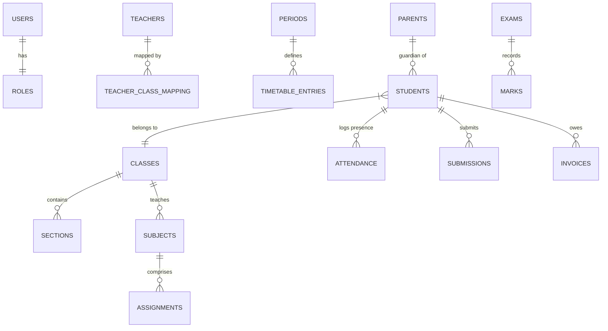

# EduDash ERP — Enterprise Engineering Handbook & Architectural Manual

Welcome to the **EduDash ERP** engineering guide. This is the single source of truth for the architecture, data system, seed pipeline, portal workflows, and backend-readiness strategy of the EduDash School ERP platform. It is designed to onboard developers, database engineers, QA testers, and technical evaluators from zero context.

---

## 🏫 Project Identity

| Property         | Value                                                              |
| :--------------- | :----------------------------------------------------------------- |
| **Live Demo**    | [https://school-erp-dashboard-lime.vercel.app/](https://school-erp-dashboard-lime.vercel.app/) |
| **Name**         | EduDash School ERP Dashboard                                       |
| **Type**         | Enterprise ERP Prototype with Backend-Ready Architecture           |
| **School Scale** | Nursery to Class 12 · 4 sections per class · 60 classes total      |
| **Data Scale**   | ~300 students · 80+ teachers · 4 user roles                        |
| **Framework**    | React 18 + Vite + React Router v7                                  |
| **UI Libraries** | TailwindCSS · Lucide React · Framer Motion                         |
| **Data Storage** | Browser `localStorage` (with in-memory cache)                      |
| **Auth**         | Role-based simulation (Student / Teacher / Parent / Admin)         |

---

## 📚 Comprehensive Documentation Library

We have consolidated and standardized all architectural and technical documentation. Before contributing, please review the relevant documents in the `docs/` directory:

- [**00-project-setup-guide.md**](./docs/00-project-setup-guide.md): Initial setup and developer environment guide.
- [**01-roles-and-permissions.md**](./docs/01-roles-and-permissions.md): Comprehensive capability matrix across all 4 user roles.
- [**02-technical-reference.md**](./docs/02-technical-reference.md): The absolute master source of truth for the entire architecture, entity field schemas, event workflows, and service layers.
- [**03-workflow-diagrams.md**](./docs/03-workflow-diagrams.md): System sequence flows and interaction diagrams.
- [**04-database-architecture.md**](./docs/04-database-architecture.md): Recommended PostgreSQL/MySQL schema tables and indexes.
- [**05-class-identity-standards.md**](./docs/05-class-identity-standards.md): Strict rules on academic class identity enforcement.
- [**06-performance-guidelines.md**](./docs/06-performance-guidelines.md): Best practices for React performance within the ERP.
- [**07-frontend-architecture.md**](./docs/07-frontend-architecture.md): Structural choices for the React SPA.
- [**08-backend-integration-contract.md**](./docs/08-backend-integration-contract.md): Core concepts for connecting the frontend to a real backend.
- [**09-module-inventory.md**](./docs/09-module-inventory.md): Inventory of all features and pages.
- [**10-backend-migration-roadmap.md**](./docs/10-backend-migration-roadmap.md): Phased approach to replacing MockDB with a real API.
- [**11-api-contracts.md**](./docs/11-api-contracts.md): Expected REST endpoints and JSON payloads.
- [**12-provider-contracts.md**](./docs/12-provider-contracts.md): TypeScript-like interfaces for the Data Provider layer.

---

## 📅 System Execution Status Matrix

| Module                      | Sub-System                                                                                                                           | Status      |
| :-------------------------- | :----------------------------------------------------------------------------------------------------------------------------------- | :---------- |
| **Authentication**          | Unified login, RBAC, session persistence                                                                                             | ✅ Complete |
| **Student Portal**          | Dashboard, timetable, profile, attendance, fees, transport, docs, achievements, mentor, clubs, leave                                 | ✅ Complete |
| **Parent Portal**           | Multi-child switcher, fee details, transport monitoring                                                                              | ✅ Complete |
| **Teacher Portal**          | Dashboard, attendance, marks/exams, assignments, question papers, timetable, student perf, leave, mentor, clubs, reports             | ✅ Complete |
| **Admin Portal**            | Students 360, Teachers, Parents, Classes, Subjects, Timetable, Attendance, Fee Mgmt, Transport, Notices, Clubs, Workload Analytics   | ✅ Complete |
| **Seed System**             | Institutional data generation for all entities                                                                                       | ✅ Complete |
| **Database Architecture**   | SQL schema models and relationships defined                                                                                          | ✅ Complete |
| **Documentation Update**    | Consolidation and standardization of technical guides                                                                                | ✅ Complete |
| **Backend Contract Freeze** | API and provider contracts, TypeScript types definition                                                                              | 🟡 In Progress |
| **Real Backend**            | REST/GraphQL APIs mapping to `getDataProvider()`                                                                                     | 🔴 Planned  |

**Legend**: `✅ Complete` · `🟡 In Progress` · `🔴 Planned`

---

## 🏛️ System Rationale: Why Frontend-First?

EduDash was deliberately built **Frontend-First, Backend-Ready** to solve critical enterprise risks early:

1. **API Contract Preparation** — Abstract async services define complete data contracts (JSON payloads, query parameters) before any backend is written.
2. **Workflow Validation** — Complex multi-portal flows (multi-child switching, assignment pipelines, question paper approvals) are validated in the browser by real users before any database schema is committed.
3. **Layout Stabilization** — ERPs are data-dense and prone to layout shifts. Building the shell first permanently stabilizes nested layout outlets, loading skeletons, and memoization boundaries.

---

## 🗃️ Folder Architecture

The project has been refactored into a highly modular, cleanly separated architecture:

```txt
src/
 ├── assets/             # Static images, logos
 ├── auth/               # RBAC roles, navigation maps, portal route definitions
 ├── components/         # Shared UI components and layout pieces
 │   ├── admin/          # Admin-specific components
 │   ├── parent/         # Parent-specific components
 │   ├── shared/         # Cross-portal components (e.g., DataGrids, Modals)
 │   └── teacher/        # Teacher-specific components
 ├── context/            # Global state context providers
 ├── contracts/          # Provider interfaces and expected backend payloads
 ├── data/               # Data access layer
 │   ├── mockDB/         # MockDB core engine, index facade, and seed generators
 │   └── providers/      # localProvider implementation and future apiProvider
 ├── hooks/              # Custom React hooks
 ├── initialization/     # Boot pipeline (storage setup, migrations, seeding)
 ├── layouts/            # Role-scoped layout shells
 ├── pages/              # Portal pages (lazy loaded)
 ├── persistence/        # localStorage interaction logic and keys
 ├── routes/             # Route definitions and ProtectedRoute wrapper
 ├── selectors/          # State derivations and formatting
 ├── services/           # Async service modules interacting with Data Provider
 ├── shared/             # Shared utilities and configurations
 ├── styles/             # Global CSS and Tailwind configs
 ├── translations/       # i18n dictionaries
 └── types/              # TypeScript-like type definitions and enums
```

---

## ✨ New Features & Modules

### 🎓 Student 360° View
A comprehensive aggregation module for Administrators (`/admin/students/:id`). It provides a complete, unified profile of any student, featuring:
- **Attendance Records**
- **Academic Performance & Results**
- **Parent/Guardian Details**
- **Transport & Route Information**
- **Document Vault**
- **Account & Financial Information**

### 📝 Question Paper Management
A complete end-to-end workflow for examination creation:
- **Teacher Workflow:** Create new papers, save as drafts, and submit for approval.
- **Admin Workflow:** Review submitted papers, with capabilities to approve or reject them based on institutional standards.

---

## 🔀 Backend Readiness & Data Access Architecture

EduDash is currently in the **Contract Freeze Phase**, ensuring it is fully prepared for backend integration.

```txt
  Page/Component
      ↓
  Service (e.g., studentService.getStudentProfile)
      ↓
  Data Provider (getDataProvider → provider.getStudents())
      ↓
  MockDB (mockDB/index.js) → persistence/storage.js
```

### The Backend-Swap Seam
`src/data/providers/` acts as the abstraction layer. The active provider is `localProvider.js`.
**To connect a real backend**: Simply swap the active provider to an `apiProvider.js` that implements the exact same interface (defined in `src/contracts/`) using `fetch()` or `axios`. Zero changes are required in the React UI, Hooks, or Services.

---

## 🏢 Portal Overview

### 🧑‍🎓 Student Portal
**Role**: Data consumer and task executor.
*Dashboard, Courses, Weekly Timetable, Examinations, Assignments, Achievements, Leave Requests, Clubs, Mentor Support.*

### 🧑‍👩‍👦 Parent Portal
**Role**: Auditor and supervisor.
Uses `ChildScopeSwitcher` to view multiple children. Dedicated features for Fee Details and Transport Tracking.

### 🧑‍🏫 Teacher Portal
**Role**: Primary data writer.
*Attendance Mgmt, Assignments, Marks & Exams, Question Papers, Class Timetable, Student Performance, Reports & Analytics, Leave Mgmt.*

### ⚙️ Admin Portal
**Role**: System governance and master data management.
*Student 360, Teachers, Parents, Classes, Subjects, Subject Allocation, Timetable, Examinations, Attendance Overview, Leave Approvals, Fee & Transport Mgmt, Workload Analytics.*

> **Note:** All 23+ admin pages have been fully refactored to use async Services and Data Providers. Direct `MockDB` imports have been eliminated, paying down earlier architectural debt.

---

## 🔄 Cross-Portal Data Flow Examples

### Assignment Submission Flow
1. Teacher publishes assignment in `AssignmentsManagementPage`
2. `assignmentService` writes to provider + creates pending submissions
3. Student sees assignment in task feed and submits it
4. Teacher sees submission for grading in their assignments page

### Question Paper Approval
1. Teacher drafts a question paper and submits it.
2. Admin reviews the paper in `QuestionPapersAdminPage`.
3. Admin approves → state updates to `APPROVED` → Paper becomes available for scheduled exams.

---

## 🗃️ Entity Relationship Diagram (ERD)



---

## 🛠️ Database Migration Guidelines

When migrating from localStorage MockDB to a persistent SQL database (PostgreSQL recommended):
- Enforce **Third Normal Form (3NF)**.
- Use `ON DELETE RESTRICT` on master data (Classes, Subjects).
- Create appropriate indexes (e.g., `CREATE INDEX idx_attendance_student_date ON attendance(student_id, date);`).
- Utilize **Soft Deletes** (`deleted_at TIMESTAMP NULL`) for auditable institutional entities.

For more details, review [04-database-architecture.md](./docs/04-database-architecture.md).

---

## ⚙️ Application Boot Sequence

`initializeERP()` runs **synchronously before React mounts**:
1. `ensureRequiredKeys()`: Prevents null-access crashes.
2. `checkAndSeed()`: Generates dynamic institutional mock data if missing.
3. `runMigrations()`: Transforms existing mock records to match latest schema version stamps.
4. `validateAll()`: Checks structural integrity before the UI renders.

---

## 🌱 Seed Data System

All institutional data is generated at first load and persisted to localStorage. There is **one source of truth per entity**, located under `src/data/mockDB/seed/`.

---

## ⚠️ Current Limitations

1. **localStorage Scope**: All data is browser-local. Different browsers/devices do not share data.
2. **Mock Authentication**: Passwords are stored in plaintext in `erp_authUsers` — no hashing.
3. **No Real-Time Sync**: Changes in one browser tab do not propagate to others without a page refresh.
4. **Simulated File Uploads**: File attachment UIs simulate progress locally; no actual file is stored.

---

## 🛠️ Local Development & Setup

```bash
# Clone and enter the directory
cd school-erp-dashboard

# Install dependencies
npm install

# Start local dev server
npm run dev

# Run tests
npm run test
```

### Resetting Seed Data (Development)
When seed data logic changes, clear the browser storage to force a re-seed:
```js
// In browser console:
localStorage.clear();
// Then refresh — new seed runs automatically
```

Once built, `/dist` is fully optimized and ready for deployment to Vercel, Netlify, or AWS S3.
